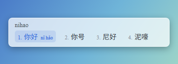
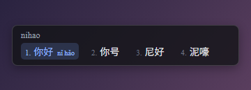
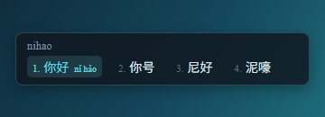
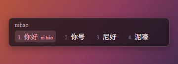
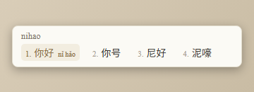
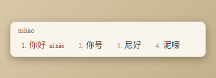
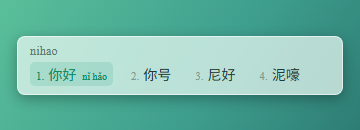
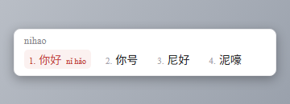

# rime-chayu

茶鱼的个人 [Rime](https://rime.im) 配置，基底为[雾凇拼音 rime-ice](https://github.com/iDvel/rime-ice)。全拼单方案 + 中英混输，个人定制全部收敛在两个补丁文件中。

## 定制内容

- **方案**：仅雾凇拼音（全拼）；中英混输、简繁切换、`Uu` 部件反查、`V` 符号模式、`/rq` `/sj` 日期时间均为上游内置能力，通过 `default.custom.yaml` 裁定启用范围
- **配色**：8 套 `茶鱼·` 前缀方案——雾岭 / 墨玉 / 靛青 / 胭脂（半透明玻璃），象牙白 / 宋韵 / 翡翠（平实纸感），雪松（印石），定义于 `weasel.custom.yaml`
- **字体**：中文 苹方（PingFang SC，未装则回退思源黑体），拉丁与序号 Times New Roman
- **预览图**：`preview/` 下按方案 id 存放设定界面缩略图
- **设计稿**：`design/` 配色画布（浏览器打开），记录各方案的视觉依据与混搭思路

## 配色预览

| 茶鱼·雾岭玻璃 | 茶鱼·墨玉玻璃 | 茶鱼·靛青夜航 | 茶鱼·胭脂暮色 |
|:---:|:---:|:---:|:---:|
|  |  |  |  |

| 茶鱼·象牙白新罗马 | 茶鱼·宋韵纸本 | 茶鱼·翡翠汽水 | 茶鱼·雪松印石 |
|:---:|:---:|:---:|:---:|
|  |  |  |  |

上排为玻璃半透明款（缩略图背景示意桌面透底效果），下排为不透明款。

## 安装

前提：Windows + [小狼毫](https://rime.im/download/) 0.17.4+。

```powershell
git clone git@github.com:chayu163/rime-chayu.git "$env:APPDATA\Rime"
& "C:\Program Files\Rime\weasel-0.17.4\WeaselDeployer.exe" /deploy
```

克隆即得全部定制。配色可在小狼毫「输入法设定」中随时切换。

## 使用速查（全拼）

| 功能 | 输入 | 效果 |
|---|---|---|
| 方案选单 | `` Ctrl+` `` 或 F4 | 简繁、全半角、中英标点切换 |
| 拆字反查 | `uU` + 部件拼音 | 生僻字与注音 |
| 辅码检字 | 拼音 + `` ` `` + 部首拼音 | 二次筛选候选 |
| 符号大全 | `vhelp` | 浏览全部符号支持列表 |
| 日期时间 | `rq` `sj` `xq` `dt` `ts` | 日期 / 时间 / 星期 / 档期 / 时间戳 |
| 农历 | `nl`；`N` + 日期 | 今日农历；指定日期农历与节气 |
| 计算器 | `cC` + 算式 | 计算结果 |
| Unicode | `U` + 码位（如 `U62fc`） | 对应字符 |
| 数字大写 | `R` + 数字 | 人民币 / 数字大写 |
| UUID | `uuid` | 随机 UUID |
| 以词定字 | `[` / `]` | 取候选词的首字 / 末字 |
| 词汇别名 | 直接输入 | 自动展示翻译、别名、化学式、简称 |
| 删词降权 | `Ctrl/Shift+Del` | 删除错词或使其降权 |
| 英文大小写 | 大写字母开头 | 首字母大写 / 全大写单词 |

> 速查表整理自 rime-ice（2026-09-05 快照）；GIF 功能演示与完整说明以[上游教程](https://github.com/iDvel/rime-ice#功能演示和使用教程)和[详细文档](https://dvel.me/posts/rime-ice/)为准。可选装[万象语法模型](https://github.com/iDvel/rime-ice#目前能用的部分语法模型)提升长句预测。上游文档变更会由仓库的 upstream-watch 工作流开 issue 提醒。

## 定制入口

只改以下两个文件，上游文件保持原样，更新时直接覆盖：

| 文件 | 职责 |
|---|---|
| `default.custom.yaml` | 行为：方案列表、候选数 |
| `weasel.custom.yaml` | 外观：配色定义、字体栈、激活方案 |

颜色格式为 `0xAABBGGRR`（透明度/蓝/绿/红），玻璃款半透明依赖 AA 通道。

## 致谢

词库、方案与 Lua 脚本均来自 [rime-ice](https://github.com/iDvel/rime-ice)，本仓库仅含个人定制层。
